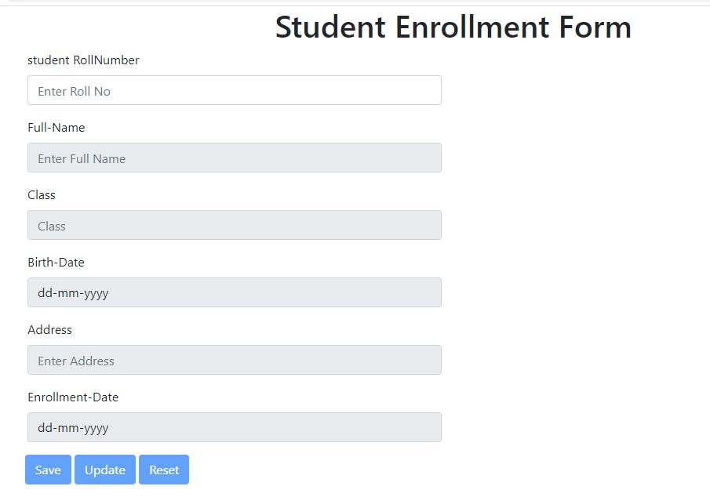
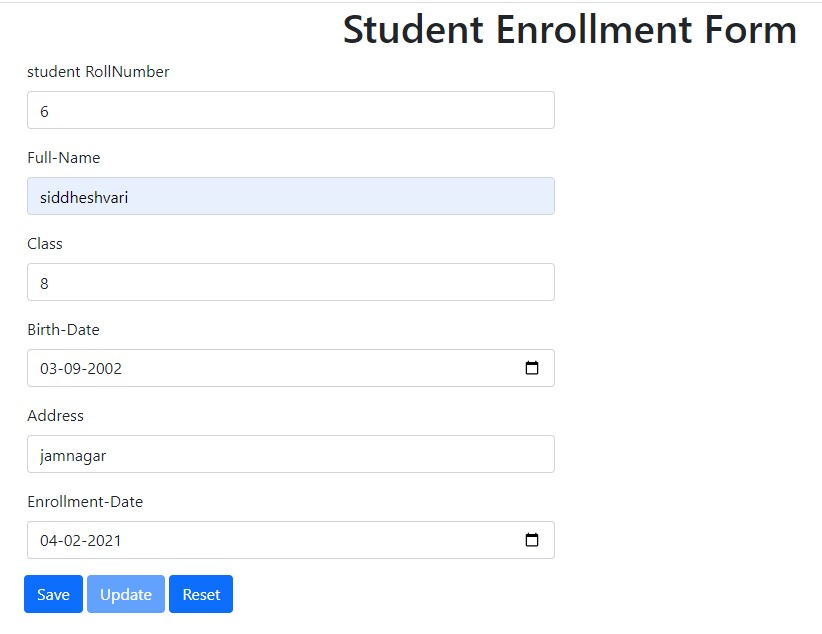
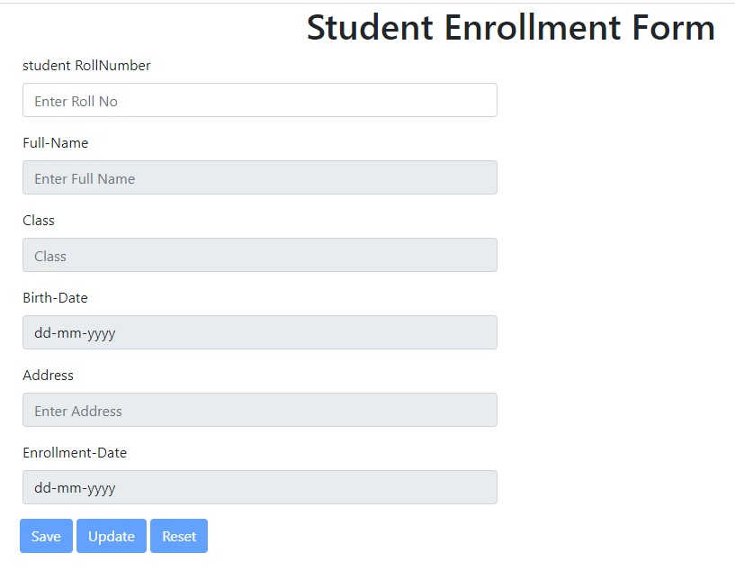
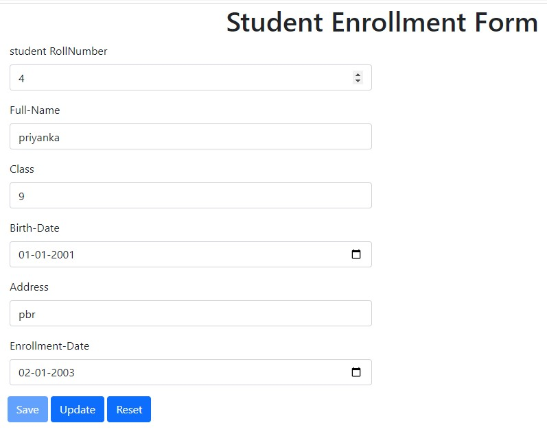

# login2explore
This is a form for student enrollment using JsonPowerDB as Database JsonPowerDB is used to perform CURD operation

**registration image**

**after adding details we will see enabled buttons which are save and reset**

**after save and reset form will be empty**

**after adding anyof the previous details we will see that details autocomplete and update button**

